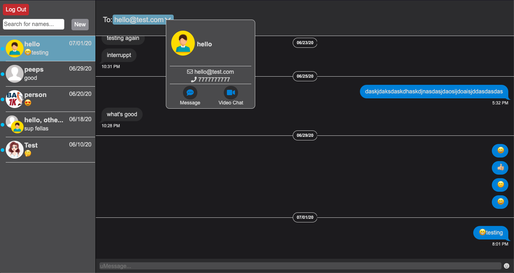
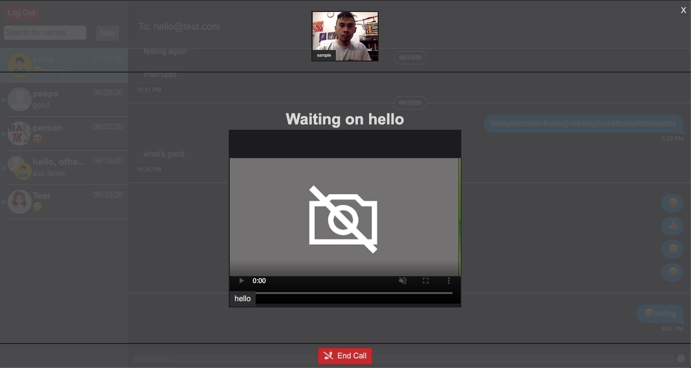

This project was bootstrapped with [Create React App](https://github.com/facebook/create-react-app).

# uMessage Client 📱

* [Deployed Version](https://umessenger-frontend.herokuapp.com/)

## Message Interface Sample

## Video Interface Sample

# Getting Started
Before setting up, make sure the server is installed along with Node.js and NPM

## Prerequisites
If it is not installed, go in your terminal, and follow the steps:

1. Install the [server](https://github.com/reireynoso/photo-mern) 
2. Install [Node and NPM](https://www.npmjs.com/get-npm)

## Setup

From your terminal,

1. Clone the repo and `cd` into the folder
2. Install dependencies with `npm install`
3. Setup and launch the [server](https://github.com/reireynoso/umessenger-app/tree/master/backend) first with `npm run dev` and run the react application with `npm run start`

# Built With

* React
* Redux
* SCSS

In progress...

# Tools

* Moment.js (formatting time instances)
* Emoji-Mart (emoji library)
* React-Router
* Socket.io 
* PeerJS

# Authors
Reinald Reynoso